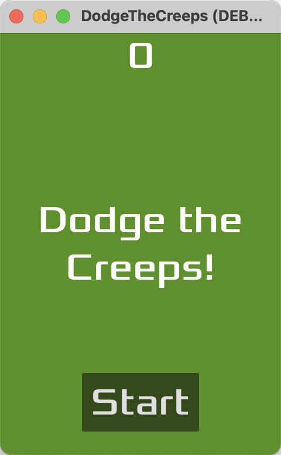
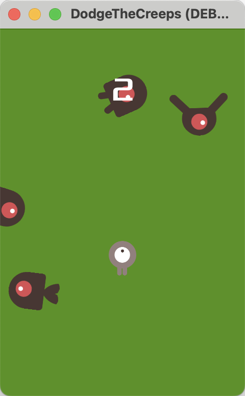
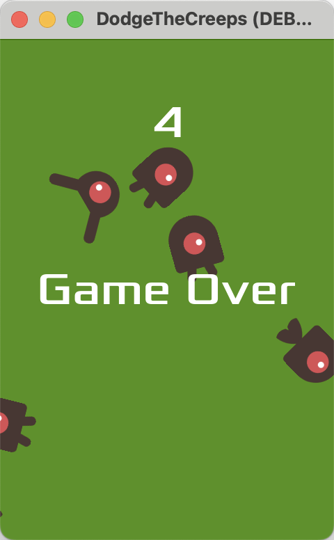

# Dodge the Creeps - A Godot 2D Game

## Overview
Dodge the Creeps is a simple 2D game built using the **Godot Engine 4.4**, following the official [Godot 2D game tutorial](https://docs.godotengine.org/en/stable/getting_started/first_2d_game/index.html). The objective is to avoid the incoming enemies ("creeps") for as long as possible while your score increases over time.

## Screenshots

### Title Screen

### Gameplay

### Game Over

## Features
- **Player Movement**: Move around freely using the arrow keys or WASD.
- **Enemy Spawning**: Creeps spawn at random locations and move towards random directions.
- **Score System**: Score increases over time as you survive.
- **Game Over Screen**: When hit, the game displays a message and allows restarting.
- **Audio Effects**: Background music and sound effects for an immersive experience.
- **Simple UI**: Display of score and game status messages.

## Controls
- **Arrow** - Move the player
- **Mouse / Touchpad Click** - Start the game (click the Start button after Game Over)

## How to Play
1. Click "Start" to begin the game.
2. Use the arrow keys to dodge the incoming creeps.
3. Survive as long as possible to increase your score.
4. If you get hit, the game ends, and you can restart.

## Installation & Running the Game
### Play in Godot
1. Install [Godot 4.4](https://godotengine.org/download).
2. Open Godot and load this project.
3. Click **Run** to start the game.

### Export as an Executable
1. Open **Project > Export**.
2. Choose a platform (Windows, Linux, macOS, or Web).
3. Click **Export Project** and run the generated executable.

## Known Issues & Troubleshooting
- **Game Over doesn't stop the timer**: Ensure `StartTimer` is stopped in `game_over()`.

## Credits
- Developed by: **Shiyin Li**
- Tutorial: [Godot Docs - First 2D Game](https://docs.godotengine.org/en/stable/getting_started/first_2d_game/index.html)
- Engine: [Godot Engine](https://godotengine.org)
- Assets & Sounds: Provided by the tutorial or custom-made

## License
This project is open-source under the **MIT License**. Feel free to modify and share!

